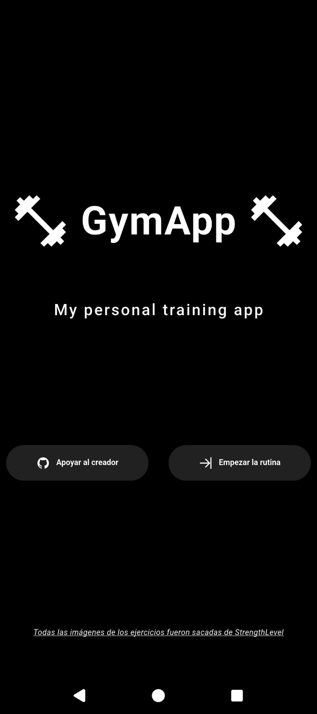
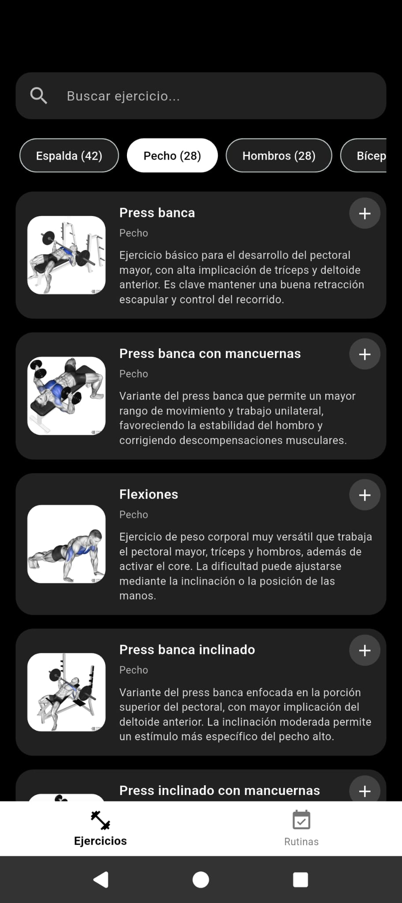
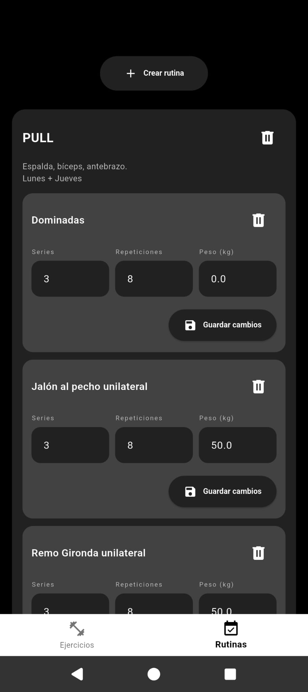

# 🏋️ Gym Routine App

Flutter mobile app to track your gym routines.

## 🚀 Features
- Crate custom routines
- Add exercises to routines
- Get a log of your progress
- Search for new exercises

## 📱 Screenshots

  
  
  

## 🛠 Tech Stack
- Flutter / Dart
- Riverpod (Riverpod 3 and Riverpod code generation)

## 📦 Installation

- **Android:** Download the [Gym Routine App APK](./app-release.apk) directly from this repository.
- **iOS:** I don't like Apple.
